<p align="center">
  
</p>

<p align="center">
  
  
  
</p>

[简体中文](README.md) | English

# Paperglow Theme

Paperglow is a warm paper-inspired theme for Typora, Obsidian, and VS Code / Cursor. It replaces flat white canvases with sunlit paper tones, quiet burnt-clay accents, and a softer dark palette that feels closer to a late-night study than a terminal.

## Highlights

- Warm paper light mode and deep-ink dark mode
- Rounded reading-card surfaces for both writing and preview areas
- Unified Montserrat / Noto Sans SC / JetBrains Mono typography
- Soft quote blocks, 16px code blocks, clay-toned links, and consistent callouts
- VS Code workbench + native Markdown preview share the same Paperglow palette

## Preview

### Obsidian

<p align="center">
  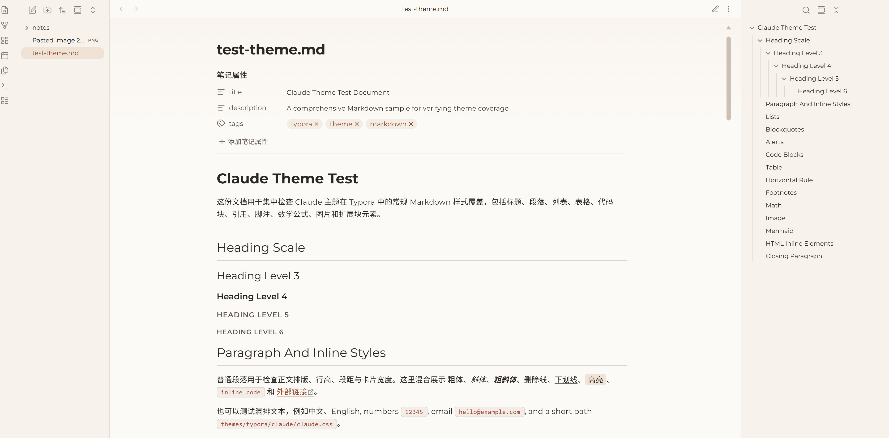
</p>

<p align="center">
  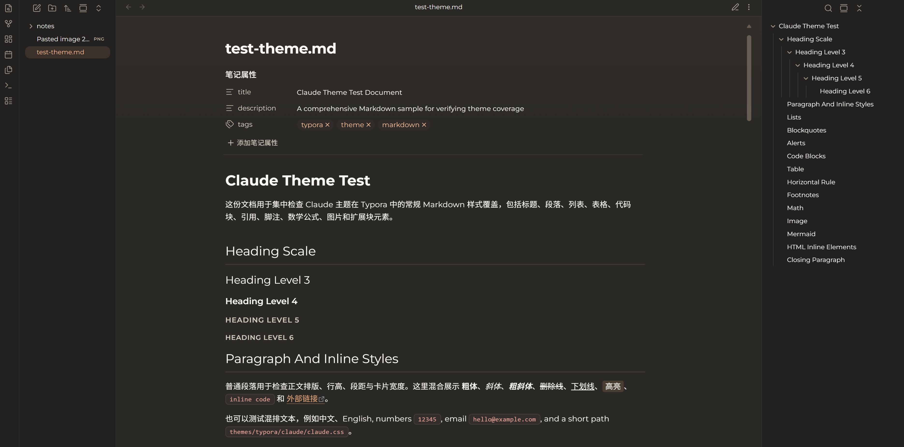
</p>

### Typora

<table>
  <tr>
    <td>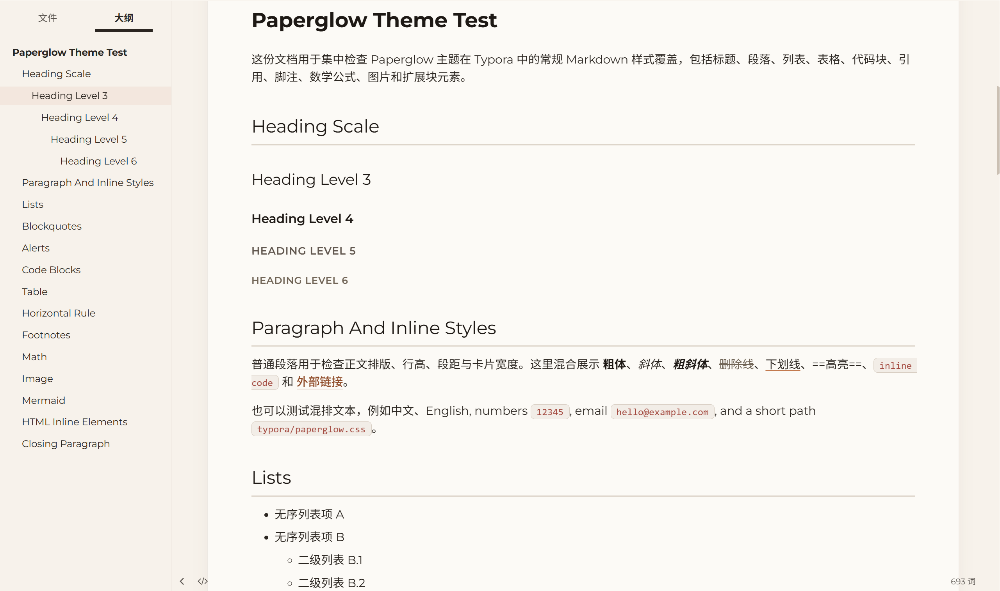</td>
    <td>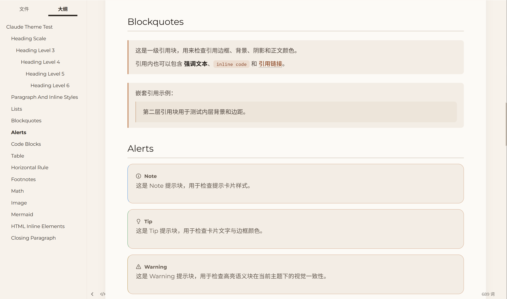</td>
  </tr>
  <tr>
    <td>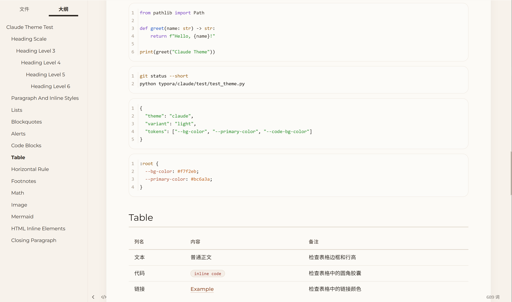</td>
    <td>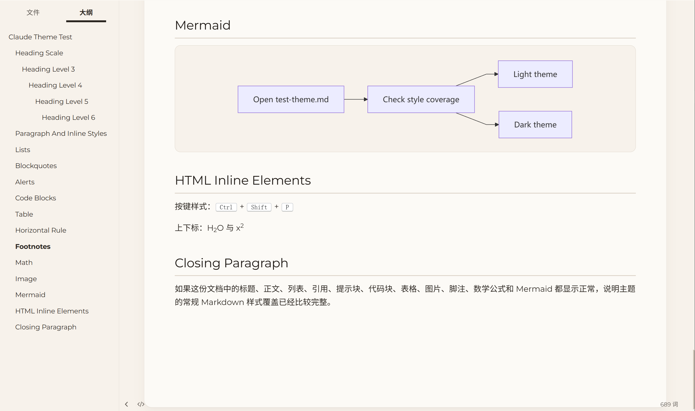</td>
  </tr>
  <tr>
    <td>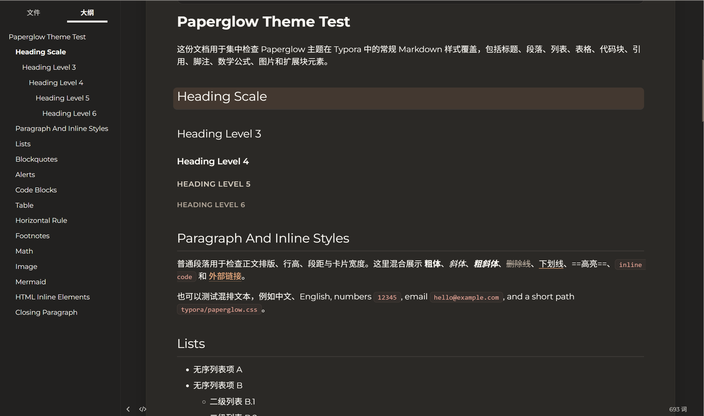</td>
    <td>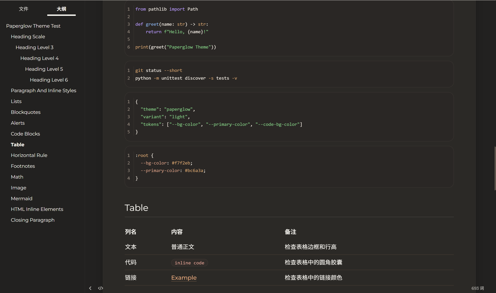</td>
  </tr>
</table>

### VS Code / Cursor

<table>
  <tr>
    <td>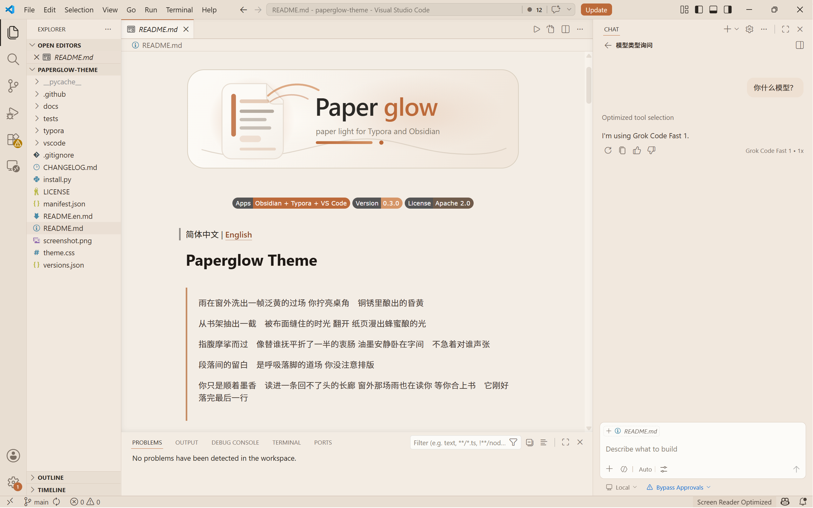</td>
    <td>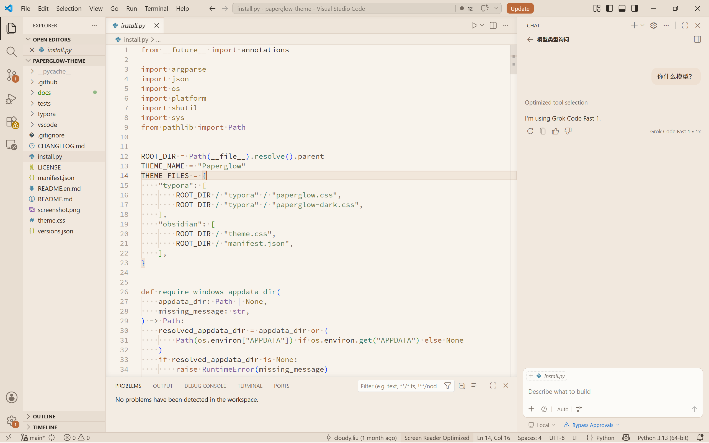</td>
  </tr>
  <tr>
    <td>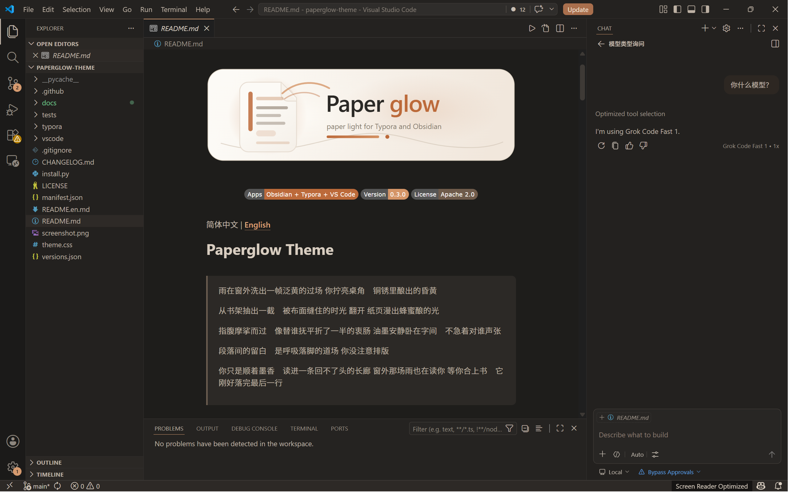</td>
    <td>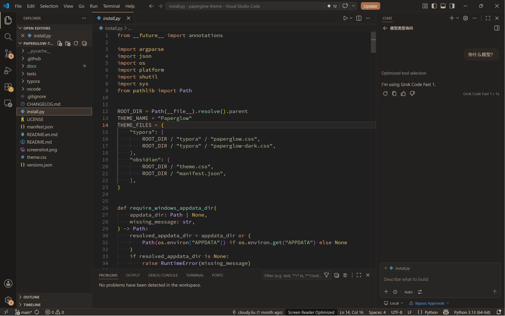</td>
  </tr>
</table>

## Supported Apps

| App | Theme | Status | Path |
|-----|-------|--------|------|
| Obsidian | Paperglow | ✅ Maintained | [`theme.css`](theme.css) + [`manifest.json`](manifest.json) |
| Typora | Paperglow | ✅ Maintained | [`typora/`](typora/) |
| VS Code / Cursor | Paperglow Light + Dark | ✅ Maintained | [`vscode/`](vscode/) |

## Install

The repository ships with a lightweight installer script at [`install.py`](install.py), so you can install the theme directly without an extra packaging step.

### Obsidian

```bash
python install.py obsidian
```

The script can discover local vaults automatically. To target a single vault:

```bash
python install.py obsidian --vault "/path/to/your/vault"
```

### Typora

```bash
python install.py typora
```

Install to a custom theme directory:

```bash
python install.py typora --target-dir "C:\path\to\Typora\themes"
```

### VS Code / Cursor

#### Option 1: Command-line install

1. Download `paperglow-vscode.vsix` from the latest [Release](https://github.com/cloudy-liu/Paperglow-Theme/releases/latest) (click **Assets** to expand, then click the `.vsix` file to download)
2. Open a terminal and navigate to the directory where the `.vsix` file was saved
3. Run the install command:

```bash
# VS Code
code --install-extension paperglow-vscode.vsix
# Cursor users
cursor --install-extension paperglow-vscode.vsix
```

> If you get a "command not found" error for `code` or `cursor`, open the editor, press `Ctrl+Shift+P` to open the Command Palette, run **Shell Command: Install 'code' command in PATH**, then restart your terminal.

#### Option 2: Install from VS Code UI (recommended for new users)

1. Download `paperglow-vscode.vsix` from the latest [Release](https://github.com/cloudy-liu/Paperglow-Theme/releases/latest)
2. Open VS Code / Cursor
3. Click the **Extensions** icon in the left activity bar (or press `Ctrl+Shift+X`) to open the Extensions panel
4. Click the **⋯** button in the top-right corner of the Extensions panel, then select **Install from VSIX...**
5. In the file picker, locate the downloaded `paperglow-vscode.vsix` and confirm
6. After installation completes, click **Reload** to activate the theme

#### Activate the theme

1. Press `Ctrl+K Ctrl+T` to open the Color Theme picker
2. Select **Paperglow Light** or **Paperglow Dark**
3. Open any Markdown file and press `Ctrl+Shift+V` to use VS Code's built-in preview — it automatically picks up the Paperglow style

## Manual Install

### Obsidian

Copy [`theme.css`](theme.css) and [`manifest.json`](manifest.json) into `<vault>/.obsidian/themes/Paperglow/`, then select **Paperglow** in **Settings → Appearance → Themes**.

### Typora

Copy [`paperglow.css`](typora/paperglow.css) and [`paperglow-dark.css`](typora/paperglow-dark.css) into your Typora themes directory. `paperglow-dark.css` uses `@import` to load `./paperglow.css`, so both files must exist together.

| Platform | Path |
|----------|------|
| Windows | `%APPDATA%\Typora\themes\` |
| macOS | `~/Library/Application Support/abnerworks.Typora/themes/` |
| Linux | `~/.config/Typora/themes/` |

### VS Code / Cursor

To build from source:

```bash
cd vscode
npm ci
npm run package:vsix
```

This produces `paperglow-theme.vsix` in the `vscode/` directory. Install it using either method described above (command line or UI).

## Notes

### Typora Windows Unibody Title Bar

Paperglow styles the editor, sidebar, search panel, and part of Typora's HTML UI, but the default Windows title bar is still a native system control. If you want the top area to feel visually consistent with Paperglow, switch Typora to **Settings / Preferences → Appearance → Window Style → Unibody**, then restart Typora.

### Obsidian Highlights

- Shared Montserrat / Noto Sans SC / JetBrains Mono font system
- Warm paper light palette paired with a quieter deep-ink dark palette
- Card-like reading surfaces in both editing and reading views
- 16px code blocks, warm-gray blockquotes, clay-toned links, and aligned callouts

### VS Code / Cursor Highlights

- Complete **Paperglow Light** and **Paperglow Dark** workbench and syntax palettes — activity bar to status bar follow the same clay-warm semantics
- VS Code's built-in Markdown preview is styled via `markdown.previewStyles` so headings, blockquotes, code blocks, tables, and callouts mirror the Paperglow reading layout
- Cursor compatible — theme selection works exactly like VS Code

## Project Structure

```text
paperglow/
├── install.py                 # Installer script for Obsidian / Typora
├── manifest.json              # Obsidian theme manifest
├── screenshot.png             # Obsidian community-theme preview image
├── theme.css                  # Obsidian theme entry file
├── versions.json              # Obsidian theme version compatibility map
├── typora/                    # Typora theme files
│   ├── paperglow.css          # Typora light theme
│   └── paperglow-dark.css     # Typora dark theme, imports paperglow.css
├── vscode/                    # VS Code / Cursor extension source
│   ├── package.json           # Extension manifest (themes + markdown.previewStyles)
│   ├── themes/                # Paperglow Light / Dark color JSON
│   ├── media/                 # Markdown preview CSS, extension icon
│   └── src/                   # TypeScript entry and build scripts
├── docs/
│   ├── logo.svg               # Project logo
│   ├── typora/                # Typora preview images
│   └── obsidian/              # Obsidian preview images
├── tests/                     # Installer, docs, Obsidian, and Typora style checks
├── CHANGELOG.md               # Release notes
├── README.md                  # Simplified Chinese documentation
└── README.en.md               # English documentation
```

## License

Apache License 2.0
